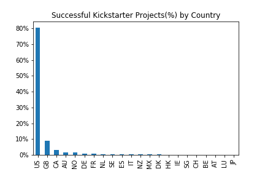
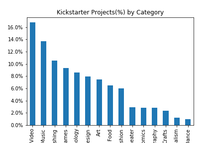
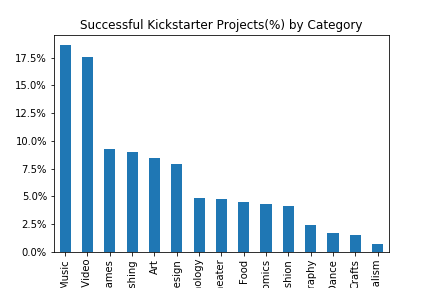
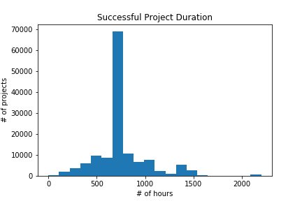
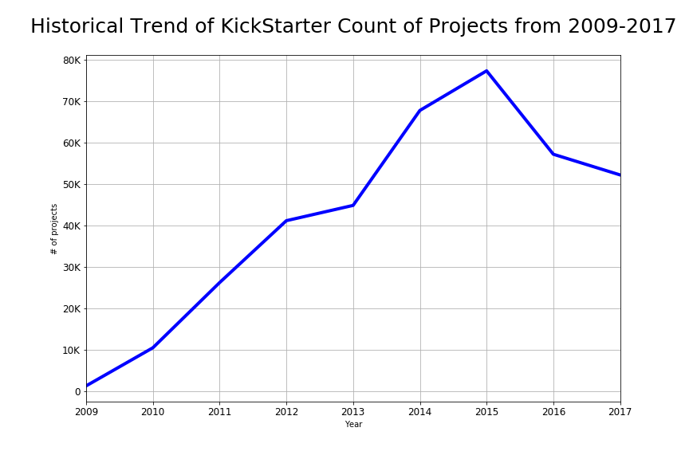
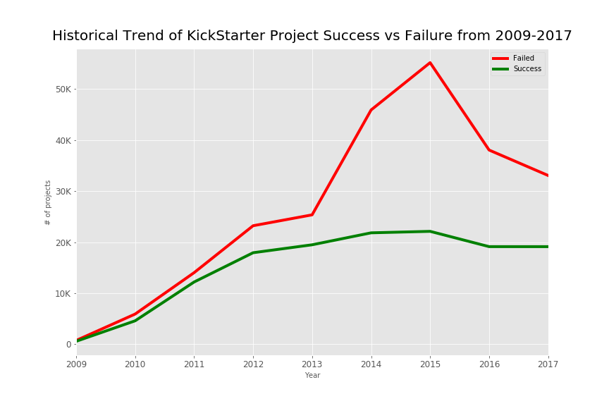

# Kick Starter

### Overview:
KickStarter is a Crowdfunding project which is a great way to raise money for a project without taking out a loan. which makes it really easy for people to show others what their idea is and why it is worthwhile. However, since a crowdfunding campaign can make or break a business idea or career it is worth the time to investigate whether there are any keys to succeeding.

### Task:
Analysis of Kickstarter projects from 2009-2017 to determine the factors which contribute to success.

### Business Questions
* What are the factors in the success of a Kickstarter project
* What category of project would most likely succeed (Art, Photography, Tech etc.)
* What should be the best duration for project to succeed.
* What is the best origin for project to be launched.

### Data Cleaning
* Get row data. In this case there were two csv files.
* Explore data. After exploring data, it came out that only one csv file is needed as it was updated version of the other one. And the other one was have two more columns but with lots of null values so of no use. 
* Remove extra spaces in columns.
* Check fo Null values.
* Check for Datatypes. and Verify that each column contains data of same same datatype.
* Calculate the necessary filed and add as extra column. Here Duration of the project has been calculated and added as extra column. WHich turned out to be one of the important feature to predict the project success.

### Analysis
* US has most backers as well as highest successful projects.

* Setting fundraising goal low helps in success in project.
The median successful project had a funding goal nearly half of the median unsuccessful project.

* Most of the projects were of Film and Video category.

* Most of the successful projects were from music category.

* Projects with duration (projects launched - fundraising deadline) of 700 hours have high chances to be successful.
The median fundraising duration of a successful project was 7 hours shorter than that of unsuccessful projects.

* It has been seen that in 2009, KickStarter grew steadily and it was highest in 2015 and has started to slow down after that. But the spike in project count from 2013 to 2015 was not accompanied by an increase in pledges as nearly all the new project volume were failures.

### Conclusion to be successful on kickstarter:
* Funding Goal: Set fundraising goal low.
* Duration: Make sure you don’t give people too much time to pledge funds.
* Category: Stick to the arts and music.
